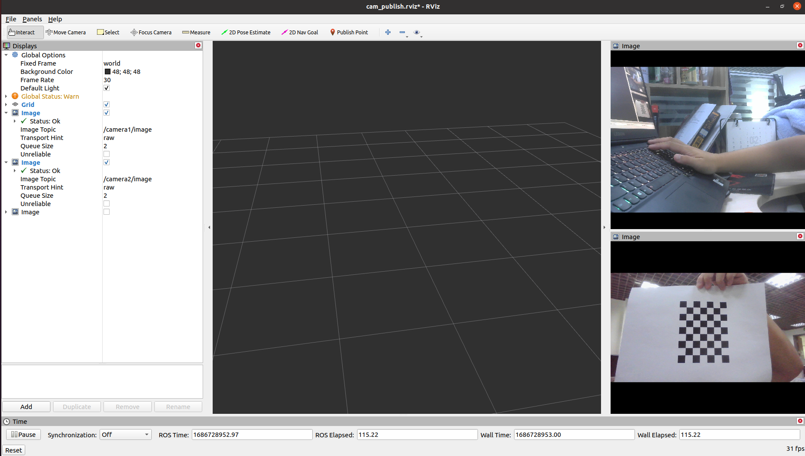
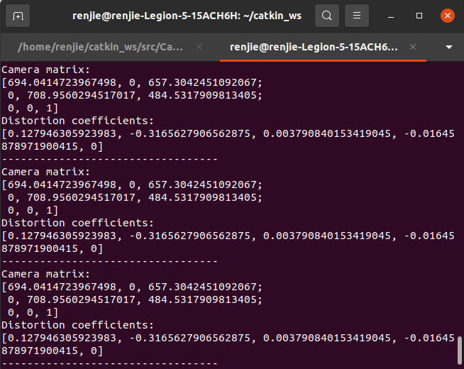
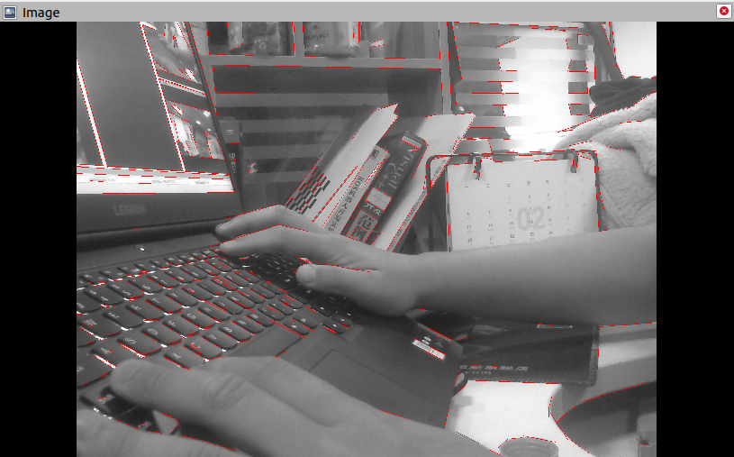

# Camera_Calibration


Tool to calibrate multi-cameras and camera-lidar

**Status: publish camera images / calibrate camera intrinsics / extract line feature**

## 1. Prerequisites
1.1 ROS neotic

1.2 OpenCV 4.2.0

1.3 C++ Standard 17

## 2. Execution
2.1 Build
```
cd ~/catkin_ws/src
git clone https://github.com/Wang-Theo/Camera_Calibration.git
cd ..
catkin_make -DCATKIN_WHITELIST_PACKAGES=cam_cali
```

2.2 Publish two cameras' images
```
source devel/setup.bash
roslaunch cam_cali cam_publish.launch 
```


2.3 Calibrate camera intrinsics
```
source devel/setup.bash
rosrun cam_cali cam_calibrate
```
You can find the calibrated image `calibrated_image.png` in folder `image`  


The calbrated result matrix is shown in terminal  


2.4 Extract line feature
```
source devel/setup.bash
rosrun cam_cali line_extract
```

